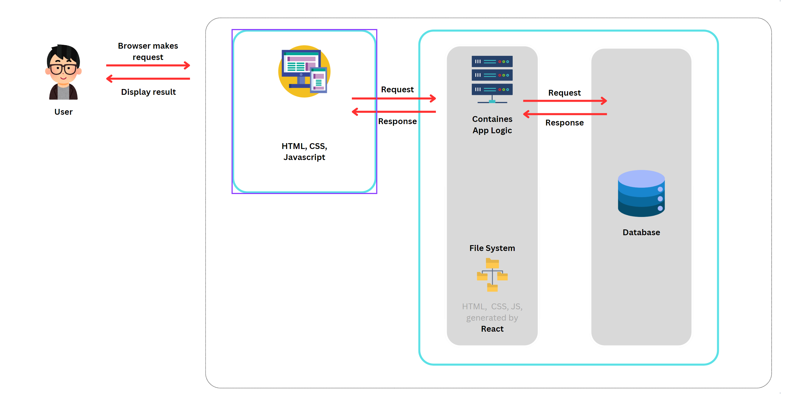
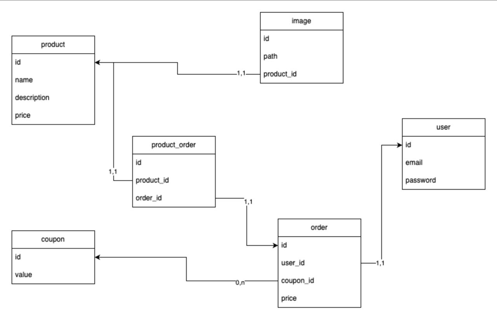

# Documentation technique

[Home](https://github.com/JaxV9/Sneakers)

### Architecture du projet 🛠

L'architecture suivante est un diagramme représentant le fonctionnement du projet sous forme de bloc. En effet chaque bloc présent ici représente une instance isolé. Le fait d'isoler chaque bloc de notre système nous permet de mieux gérer ces derniers.

De plus si nous voulons rajouter des systèmes pour se connecter à ces différents bloc nous pouvons le faire (par exemple développer une application mobile en `SWIFT` ou `Kotlin` ou tout autre logiciel de création d'application dite web app tel que `React Native` ou encore `Flutr` sera donc possible, uniqument une connexion sera nécessaire).

### Choix technique

Pour ce qui est des choix techniques, nous sommes partie sur plusieurs technologies avangardistes et au goût du jour dans l'objectif de proposer au client la meilleur expérience d'utilisation possible. Nous avons opter pour une séparation des responsabilités avec d'un côté un framework back-end et un framework front-end. De cette façon, si on choisit de faire évoluer les technologies, il sera possible de le faire sans impacter l'ensemble du projet.

#### Choix front-end

React est une bibliothèque Javascript qui permet de réaliser des SPA, c'est-à-dire des applications qui permettent de naviguer sur une seule et même page. La principale différence avec les “multiple pages application” (MPA) est qu’à chaque fois que vous cliquez sur un élément de navigation, il n’y a pas de rechargement, alors qu’avec une MPA, si. Plus concrètement, un site web en SPA ne charge que ce dont il a besoin. Finalement, la plupart des sites internet qui se veulent modernes et centrés sur l’expérience utilisateur, implémentent des SPA pour leurs applications.

Nous avons développé le POC (Proof Of Concept) avec la dernière version de`React`. `React` est LE framework dans le monde du web. Parfait pour gérer les uses-cases de VEJA, ce dernier nous permettra de développer le projet en toute sécurité.

Ce framework sera donc de choix pour développer :

- Les pages imaginée dans le cadre du workshop
- L'intégration site web marchands de VEJA

#### Choix back-end

Django Rest Framework est très populaire et il est utilisé par beaucoup de grandes entreprises technologiques. On peut notamment citer Instagram, Spotify, Mozilla, Pinterest, Dropbox ou Bitbucket. D’autres outils sont également très utilisés dans le développement d’API, comme ExpressJs, Flask, Ruby on Rails, Golang ou encore Laravel.

Nous avons besoin d'un back-end principalement pour recevoir les produits du store ainsi que les coupons de réduction.

#### Choix base de donnée

Pour notre POC, nous avons utilisé une base de donnée PostgreSQL.

## Schéma BDD 🗃

